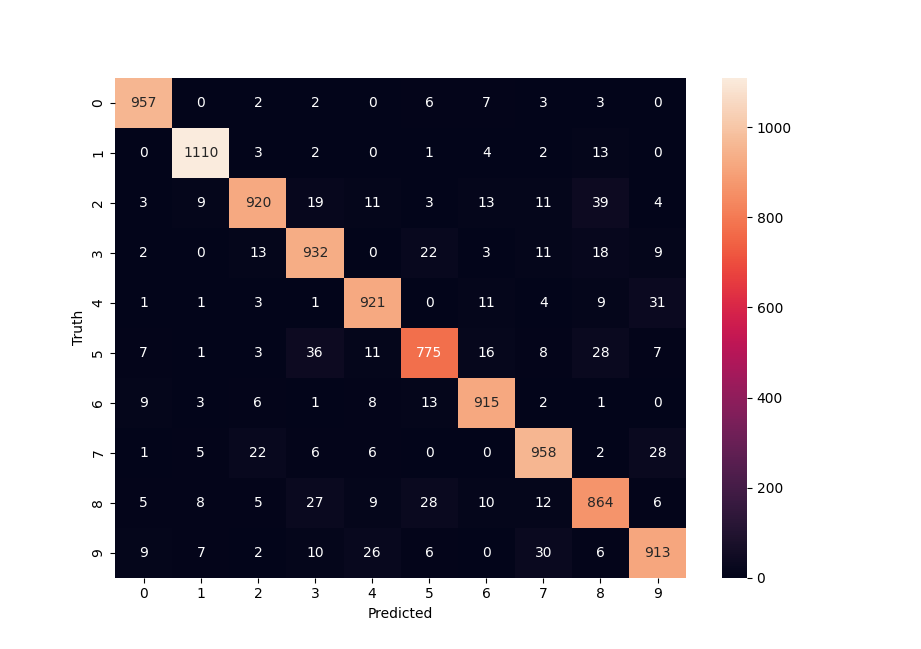

# mnist-learning
Using MNIST dataset to create machine learning model in Tensorflow. 

### NOV2022

## The MNIST Dataset

#### The MNIST is  data set contains 60,000 training images and 10,000 testing images of handwrittne digits, which are represented as a 28x28 pixel matrix. 

## Classification using Tensorflow

* The following blog was used to train the model using Tensorflow:

* https://www.milindsoorya.com/blog/handwritten-digits-classification

* The dataset was loaded from Keras; however, the dataset was challenging for my (older) computer, and IDLE was not sufficient to work with the dataset. I had to run the script natively from command prompt in order to increase efficiency. 

* Once the data was loaded, it had to be flattened in order to be inputted properly into the model, and the model can only take input as an array. Each row was appended onto itself in order create an array, giving each datapoint 784 features.

* Next, a single neural network was created using Keras. A sequential model was used with Sigmoid activation. After training, the model showed an accuracy of approximately 92%.

## Checking Accuracy

* In order to validate the model, the training set was inputted into the model. The outputs of the model were compared to the actual values through a confusion matrix. 

